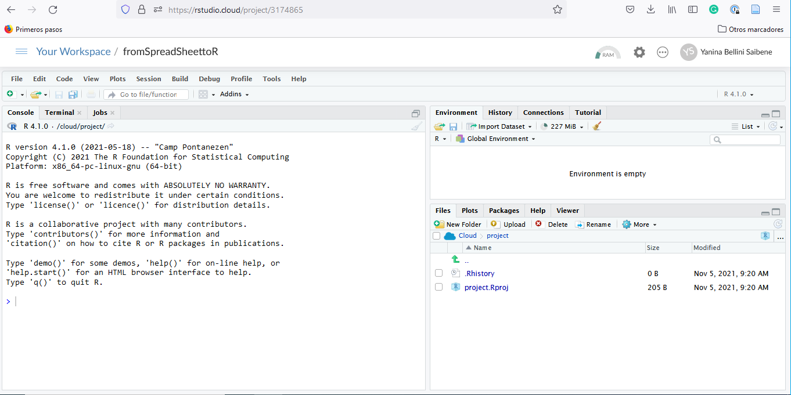

## Why R?

Spreadsheets are an admirable software. They are great for data entry, for viewing raw data and for making quick charts. If you have been using it for a long time, you must have learned a lot of tricks to get the most out of it; things like formulas, pivot tables, and even macros. But surely you also suffered from its limitations. 

In a spreadsheet there is no clear boundary between data and analysis. Overwriting data is a very real danger and complicated analyses are very hard to understand, especially if you open a spreadsheet put together by someone else (who may be you from the past). Also, repeating an analysis on different data or with different parameters can become very cumbersome. 

If what you need are frequent and automatic reports, and data analysis with many moving parts, it would be nice to be able to write a recipe-like step-by-step set of instructions and have the computer run everything automatically every time you ask it to. To be able to do that, that step-by-step has to be written in a language that the computer can understand, R is one of that languages. 

## How are we going to work?

We are going to use R as a language and RStudio as an IDE, a Integrated Development Environment. If you don't have these installed on your computer don't worry, we have this [RStudio Cloud project](https://rstudio.cloud/project/3174865) for you to work with.

To launch RStudio, double-click on the RStudio icon. Launching RStudio also launches R (actually you will probably never open R by itself).




Notice the default panes:

  * Console (entire left)
  * Environment/History (tabbed in upper right)
  * Files/Plots/Packages/Help (tabbed in lower right)

We don't need to know how to use all of this right away. We will become familiar with more of the options and capabilities throughout the workshop.

We can write code, that is, instructions to be executed by R on the Console. For example we can calculate the result two plus two by writing

```{r}
2 + 2
```

on the Console and pressing enter. 

The result appears right below. We can also save that result to an object, in this case called `x`.

```{r}
x <- 2 + 2 
```

That little arrow is the *assignment operator* and works as an `=`. Now the result is saved on the Environment as a variable with name `x` and is not printed on the console. 

This is great when we are trying out code to see if it works but we'll lose everything when we close RStudio. What we need to do is to save the code that generates your analysis. For that we use R Scripts and RMarkdown files.

We are going to have our first experience with R through RMarkdown, so let's see what an RMarkdown document is. We prepared [this example report](penguins_report.Rmd) for you, please open it on RStudio or in RStudio Cloud. The file will appear on a new forth panel on the left-hand side of the screen, and the console panel will move to bottom.

## RMarkdown

An RMarkdown file is a plain text file, with some rules and special syntax that allow us to write code and text together. When it is “knited,” the code will be evaluated and executed and the text formatted so that it creates a reproducible report or document that is nice to read and contains all your work.

This is really critical to reproducibility. It also saves us time and can help with automation tasks. This document will recreate your figures for you in the same document where you are writing the text that explain them. This will save you the effort of doing some analysis, saving a plot on a file, copy-pasting that plot into Word or Power Point or Google Slides, and having to do it all over again after discovering a typo.

Now let's see how our Penguins Report looks like.

* The top part has the Title and the output type (which in this case is an HTML document).
* Below that there are alternating _white_ and _grey_ sections. These are the two main sections that make up an RMarkdown file:
      * Grey sections are R code
      * White sections are Markdown text
* There is black, blue text and green text.

> Let’s go ahead and “Knit” the document by clicking the blue yarn () at the top of the RMarkdown file. 

We've just made an html file! This is a single webpage that we are viewing locally on our own computers. By knitting this RMarkdown document, R has formatted the markdown text and ran the R code.


### Markdown text

You can get a guide to rmarkdown [in this](add link) cheat sheet, but here is a minimum syntax to get you started:

* headers start with `# `or `## `and so on (it's important to put a space after the last `#`).
* bold words are surrounded with `**`
* and italics, with `_`

### R Code

```{r include=FALSE}
chunk_start <- "```{r label}"
chunk_end <- "```"
```

The R code is written inside code "chunks". Code chunks start with `` `r chunk_start` `` (where "label" is an optional, unique name) and end with  `` `r chunk_end` ``. In RStudio, you can create a new chunk with the `Ctrl + Alt + I` keboard shortcut.

This report shows information about the Gentoo penguins but we could change a few code lines to create the same analysis for the other two species, Adelie and Chinstrap.

> Now is your turn. Go ahead and look through the code, if you find any mention of `"gentoo"`, change it to any of the other species. 

This task is a bit cumbersome if you have to change many things any time we want to re-run the analysis for different species. But don't worry, we'll learn how to make everything more automatic by the end of the workshop. 
